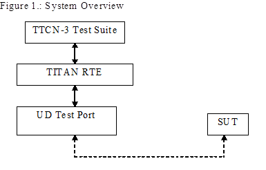

= Unix Domain Socket Test Port for TTCN-3 Toolset with TITAN, User's Guide
:author: János Kövesdi
:revnumber: 198 17-CNL 113 702, Rev. A
:revdate: 2013-09-06
:toc:

== About This Document

=== How to Read This Document

This is the User’s Guide for the UD test port. The UD test port is developed for the TTCN-3 Toolset with TITAN. This document is intended to be read together with Function Specification <<_3, [3]>>.

=== Prerequisite Knowledge

The knowledge of the TITAN TTCN-3 Test Executor <<_2, [2]>> and the TTCN-3 language <<_1, [1]>> is essential. Basic knowledge of the UD protocol is valuable when reading this document.

== System Requirements

In order to operate the UD test port the following system requirements must be satisfied:

* Platform: Solaris 5.8
* TITAN TTCN-3 Test Executor version R7A (1.7.pl0) or higher installed. For installation guide see <<_2, [2]>>.

NOTE: This version of the test port is not compatible with TITAN releases earlier than R7A.

* The same C compiler gcc version installed which the TITAN was compiled with. See the Release Notes of TITAN.

For other known limitations please see the FS <<_3, [3]>>.

== Fundamental Concepts

The test port establishes UD connection between the TTCN-3 test executor and the SUT. The test port transmits and receives UD protocol messages between the TITAN RTE and the SUT.

= The Test Port

== Overview

The UD test port offers UD primitives to the test suite in TTCN-3 format. The TTCN-3 definition of the ASPs can be found in a separate TTCN-3 module. This module should be imported into the test suite.

The test port transfers UD primitives towards the TITAN RTE and UD datagrams towards the SUT. The overview of the test system is shown on figure below:

== Installation

Since the UD test port is used as a part of the TTCN-3 test environment this requires TTCN-3 Test Executor to be installed before any operation of the UDP test port. For more details on the installation of TTCN-3 Test Executor see the relevant section of <<_2, [2]>>.

When building the executable test suite the libraries provided for the TTCN-3 Test Executor should also be linked into the executable. For more information see also <<_2, [2]>>.

== Operation Modes

=== Advanced Mode

==== Description

In advanced mode the test port provides the following functionality:

* open client/server socket
* close client/server socket
* send and receive data

The port can handle several UD sockets.

==== ASP Definition

* `UD_send_data`

* `UD_close`

* `UD_connect`

* `UD_listen`

* `UD_shutdown`

== Configuration

None.

== Start Procedure

=== TTCN-3 Test Executor

Before the executable test suite can be run the TTCN-3 modules and C++ codes should be compiled and linked into an executable program. This process can be automated using the make utility. The way how the _Makefile_ should be generated is described in <<_2, [2]>>.

NOTE: The C++ implementation files __UD_PT.hh__ and __UD_PT.cc__ of the test port should be included in the _Makefile_.

If the executable test suite is ready, run it giving the RTE configuration file as argument in your terminal:

[source]
Home> ExecutabletestSuite RTEConfigurationFile.cfg

For more information, see <<_2, [2]>>.

== Sending UD ASPs

==== Open a New Server Socket

The opening of a new server socket is requested by the sending of the `UD_listen` message to the test port. The parameter `path` contains the path of the Unix Domain Socket.

The test port answers the listen request with the `UD_listen_result`.

==== Open a New Client Socket

The opening of a new client socket is requested by the sending of the `UD_connect` message to the test port. The parameter `path` contains the path of the Unix Domain Socket.

The test port answers the connect request with the `UD_connect_result`.

The server test port answers the connect request with the `UD_connected`.

==== Sending Data

The data sending is requested with the `UD_send_data` message.

The `data` parameter contains the data to be transmitted.

The `id` specifies the socket used during data sending.

[[close-the-server-socket]]
==== Close the Server Socket.

The close the server socket operation is requested by the `UD_shutdown` message.

The `id` identifies the socket to be closed.

[[close-the-client-socket]]
==== Close the Client Socket.

The close the client socket operation is requested by the `UD_close` message.

The `id` identifies the socket to be closed.

== Receiving UD ASPs

==== Receiving Data

The data receiving is indicated via `UD_send_data` message.

The `data` parameter contains the data to be received.

The `id` specifies the socket used during data sending.

== Stop Procedure

[[ttcn-3-test-executor-0]]
=== TTCN-3 Test Executor

The test port should stop automatically after it finished the execution of all test cases. It closes down the open UD sockets towards the SUT and terminates.

The execution of the test suite can be stopped at any time by pressing `<Cntr>-c`. It will shut down the socket and terminate.

= Examples

== Error Messages

`*Cannot open socket*`

The socket system call fails.

`*User_map*`

`Conn_list` or `conn_list_server` is not Null

`*Send system call failed: <n> bytes was sent instead of <m>*`

The send system call fails.

`*Send system call failed: Write error*`

The send system call fails.

= Warning Messages

The following list shows the possible warning messages produced by the test port:

`*Cannot open socket*`

The socket system call fails.

`*Cannot bind port*`

The socket system call fails.

`*Error while listening*`

The socket system call fails.

= Terminology

None.

= Abbreviations

ASP:: Abstract Service Primitive

RTE:: Run-Time Environment

SUT:: System Under Test

TTCN-3:: Testing and Test Control Notation version 3

UD:: Unix Domain

= References

[[_1]]
[1] ETSI ES 201 873-1 (2002) +
The Testing and Test Control Notation version 3. Part 1: Core Language

[[_2]]
[2] User Guide for the TITAN TTCN-3 Test Executor

[[_3]]
[3] Unix Domain Socket Test Port for TTCN-3 Toolset with TITAN, Function Specification
